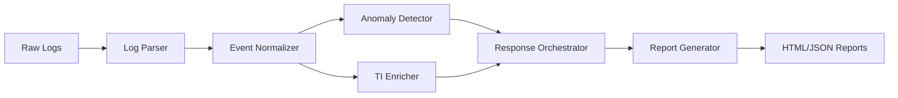

<p align="center">
  
  
  
  
</p>

<h1 align="center">🛡️ SOC Automation Toolkit</h1>

<p align="center">
  <strong>A comprehensive Python-based security automation suite designed to streamline Security Operations Center (SOC) workflows — from log ingestion and anomaly detection to threat intelligence enrichment and automated incident response.</strong>
</p>

---

## 🌟 Overview

**SOC Automation Toolkit** provides a fully modular, extensible pipeline for security operations:

```
Raw Logs ➜ Parse & Normalize ➜ Detect Anomalies ➜ Enrich with TI ➜ Automated Response ➜ Generate Reports
```

Built for both **learning** and **real-world SOC operations**, the toolkit simulates enterprise-grade security workflows with configurable rules, playbooks, and threat intelligence feeds.

---

## 🎯 Key Features

| Module | Capabilities |
|--------|-------------|
| **📊 Log Parser** | Multi-format parsing — Syslog (RFC 3164/5424), JSON, CSV, CEF. Auto-detect format with unified event normalization. |
| **🔍 Anomaly Detection** | Rule-based detection for brute force, port scans, SQLi, XSS, data exfiltration, privilege escalation. Statistical baseline learning (Welford's algorithm). |
| **🛡️ Threat Intelligence** | Connectors for AlienVault OTX & AbuseIPDB (simulated). Local IOC file support. TTL-based caching with negative cache. |
| **⚡ Automated Response** | Playbook-driven orchestration — IP blocking, account lockout, alert notifications, escalation workflows. Dry-run mode & rollback. |
| **📝 Reporting** | Beautiful HTML reports with executive summaries. JSON export for SIEM integration. Alert stats, trends & top threats. |
| **🧰 Utilities** | Centralized logging (with Rich support), IP validation, timestamp handling, YAML config loader, filename sanitizer. |

---

## 📁 Project Structure

```
soc-automation-toolkit/
├── config/
│   ├── config.yaml              # Main configuration
│   └── rules.yaml               # 10 detection rules (brute force, SQLi, port scan, etc.)
├── src/
│   ├── log_parser/              # Multi-format log parsing & normalization
│   │   ├── parser.py            # SyslogParser, JSONParser, CSVParser, CEFParser
│   │   └── normalizer.py        # EventNormalizer → NormalizedEvent schema
│   ├── detection/               # Anomaly detection engine
│   │   ├── detector.py          # AnomalyDetector with 6 detection checks
│   │   ├── rules.py             # RuleEngine with YAML rule loading
│   │   └── baseline.py          # BaselineEngine with Welford's statistical learning
│   ├── threat_intel/            # Threat intelligence integration
│   │   ├── feeds.py             # OTXFeed, AbuseIPDBFeed, LocalIOCFeed, ThreatIntelManager
│   │   ├── enricher.py          # EventEnricher with risk scoring
│   │   └── ioc_cache.py         # LRU IOCCache with TTL & negative caching
│   ├── response/                # Automated response actions
│   │   ├── actions.py           # BlockIP, LockoutAccount, SendAlert, Escalate, Quarantine
│   │   └── orchestrator.py      # ResponseOrchestrator with Playbook system
│   ├── reporting/               # Report generation
│   │   └── generator.py         # HTML/JSON SecurityReport generator
│   └── utils/                   # Common utilities
│       ├── logger.py            # Centralized logging (Rich-aware)
│       └── helpers.py           # IP validation, timestamp parsing, YAML loader
├── data/
│   ├── sample_logs/             # Sample firewall, auth, access & CEF logs
│   └── ti_cache/                # Local IOC database & cache storage
├── tests/                       # Unit & integration tests
│   ├── test_parser.py
│   ├── test_detection.py
│   ├── test_threat_intel.py
│   └── test_integration.py
├── reports/                     # Generated HTML/JSON reports
├── main.py                      # CLI entry point
├── requirements.txt             # Python dependencies
└── .gitignore
```

---

## 🚀 Quick Start

### Prerequisites
- **Python 3.8+**
- **pip** package manager

### Installation

```bash
# Clone the repository
git clone https://github.com/YOUR_USERNAME/soc-automation-toolkit.git
cd soc-automation-toolkit

# Create virtual environment (recommended)
python -m venv venv
source venv/bin/activate  # Linux/Mac
# .\\venv\\Scripts\\activate  # Windows

# Install dependencies
pip install -r requirements.txt
```

### Run the Demo

```bash
python main.py --demo
```

This runs the **full pipeline** end-to-end:
1. 📝 Generates sample security logs (firewall, auth, web access)
2. 📊 Parses and normalizes all events into a unified schema
3. 🔍 Runs anomaly detection (brute force, SQLi, port scans, etc.)
4. 🛡️ Enriches events with threat intelligence
5. ⚡ Executes automated response playbooks (dry-run)
6. 📈 Generates an HTML security report

### CLI Options

```bash
python main.py --demo                          # Full demonstration
python main.py --parse /var/log/auth.log       # Parse a specific log file
python main.py --parse access.log --format csv # Parse with format hint
python main.py --generate-samples              # Generate sample logs only
python main.py --help                          # Show help
```

---

## ⚙️ Configuration

### Main Config — `config/config.yaml`

```yaml
# Log sources
log_sources:
  - name: "firewall_logs"
    path: "data/sample_logs/firewall.log"
    format: "syslog"

# Threat Intelligence
threat_intel:
  otx:
    enabled: true
    api_key: "YOUR_OTX_API_KEY"
  cache:
    ttl: 86400  # 24 hours

# Detection thresholds
detection:
  thresholds:
    failed_login_count: 5
    failed_login_window: 300  # seconds
    port_scan_threshold: 10

# Automated Response
response:
  auto_response_enabled: false
  dry_run: true  # Safe mode — log actions without executing
```

### Detection Rules — `config/rules.yaml`

10 pre-configured rules covering:
- Brute force login detection
- Port scan activity
- Impossible travel
- After-hours access
- Data exfiltration
- Known malicious IP connections
- SQL injection patterns
- Privilege escalation
- Malware hash matching
- DNS tunneling

---

## 🧪 Testing

```bash
# Run all tests
python -m pytest tests/ -v

# Run specific test module
python -m pytest tests/test_parser.py -v

# Run with coverage
python -m pytest tests/ --cov=src
```

---

## 📊 Sample Output

### Alert Example
```
🚨 ALERT [HIGH] Brute force attack detected from 45.33.32.156
   Rule: Brute Force Login Attempt
   Events: 6 failed login attempts in 300 seconds
   Recommendation: Consider blocking the source IP
```

### HTML Report
The generated HTML report includes:
- Executive summary with key metrics
- Alert distribution by severity
- Top threat source IPs
- Detection rules triggered
- Automated response actions taken

---

## 🔧 Extending the Toolkit

### Add a New TI Feed
```python
from src.threat_intel.feeds import ThreatIntelFeed

class MyCustomFeed(ThreatIntelFeed):
    @property
    def name(self) -> str:
        return "My Custom Feed"

    def fetch_indicators(self):
        # Implement your feed logic
        ...

    def lookup(self, value, indicator_type="ip"):
        # Implement your lookup logic
        ...
```

### Add a New Detection Rule
```yaml
# In config/rules.yaml
- id: "RULE011"
  name: "Custom Rule"
  severity: "high"
  type: "pattern"
  conditions:
    event_type: "web_request"
    patterns:
      - "(?i)(suspicious_pattern)"
  actions:
    - "alert"
    - "block_ip"
```

### Add a New Response Action
```python
from src.response.actions import ResponseAction, ActionType, ActionResult

class MyCustomAction(ResponseAction):
    @property
    def action_type(self):
        return ActionType.RUN_SCRIPT

    def execute(self, target, context=None):
        # Implement your action logic
        ...
```

---

## 🏗️ Architecture



---

## 🛠️ Tech Stack

| Component | Technology |
|-----------|-----------|
| Language | Python 3.8+ |
| Config | PyYAML |
| HTTP | Requests |
| Templates | Jinja2 |
| Console | Rich |
| Testing | Pytest |
| Validation | jsonschema |

---

## 📝 License

This project is developed for educational purposes as part of a SOC automation training program. Licensed under the [MIT License](LICENSE).

---

## 🤝 Contributing

Contributions are welcome! Please ensure:
- All tests pass before submitting (`pytest tests/ -v`)
- Code follows existing style conventions
- New features include appropriate tests and documentation

---

## 📚 References

- [Syslog RFC 3164](https://tools.ietf.org/html/rfc3164) / [RFC 5424](https://tools.ietf.org/html/rfc5424)
- [Common Event Format (CEF)](https://www.microfocus.com/documentation/arcsight/)
- [MITRE ATT&CK Framework](https://attack.mitre.org/)
- [AlienVault OTX](https://otx.alienvault.com/)
- [AbuseIPDB](https://www.abuseipdb.com/)

---

<p align="center">
  Built by Ro0tk1e for the cybersecurity community
</p>
